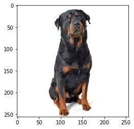
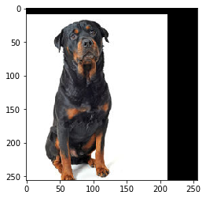
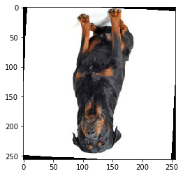

We will use this package to amplify ("augment") a single image.

The library randomly rotates, flips along axis, translates, adds noise, and adds "black boxes" to images to increase the number of usable data for a machine learning algorithm.


```python
import DataAugmentation as da

import matplotlib.pyplot as plt
import numpy as np
%matplotlib inline
```

Augment function signature:  <br />
`def augment(images, labels=None, amplify=2):` <br />

Input Data: <br />

`images` shape: (batch_size, height, width, channels=3) <br />
`labels` shape: (batch_size, 3) [this is an optional parameter]<br />
`amplify` is how many (randomly altered) copies of the original image(s) you want to produce


```python
# Sample image to amplify
sample = plt.imread('samples/dog_icon.jpg')
plt.imshow(sample)
```


    <matplotlib.image.AxesImage at 0x1161fe550>





```python
sample.shape #Need to reshape to (batch_size, height, width, channels)
sample = np.reshape(sample, (1,256,256,3))
```


```python
augmented_data = da.augment(sample, amplify=10)
```


```python
augmented_data.shape
#First image is original, rest are synthesized
```


    (10, 256, 256, 3)


```python
plt.imshow(augmented_data[1])
#Randomly translated
```


    <matplotlib.image.AxesImage at 0x118a3bd68>





```python
plt.imshow(augmented_data[7])
#Look carefully, random noise added
```


    <matplotlib.image.AxesImage at 0x118e4e080>


```python
plt.imshow(augmented_data[6])
#Randomly rotated
```


    <matplotlib.image.AxesImage at 0x118f488d0>




